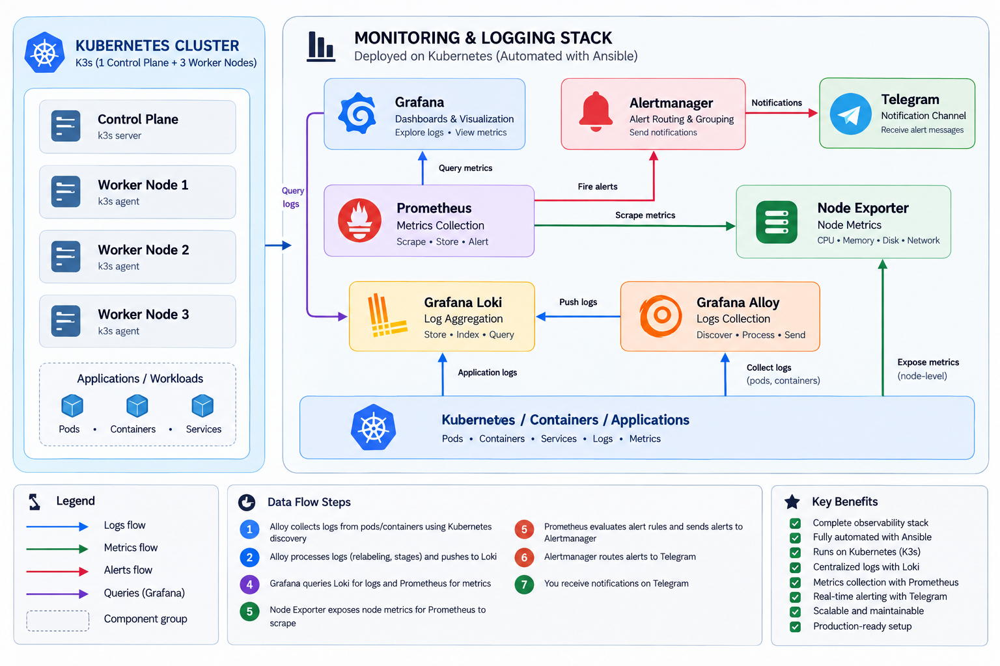
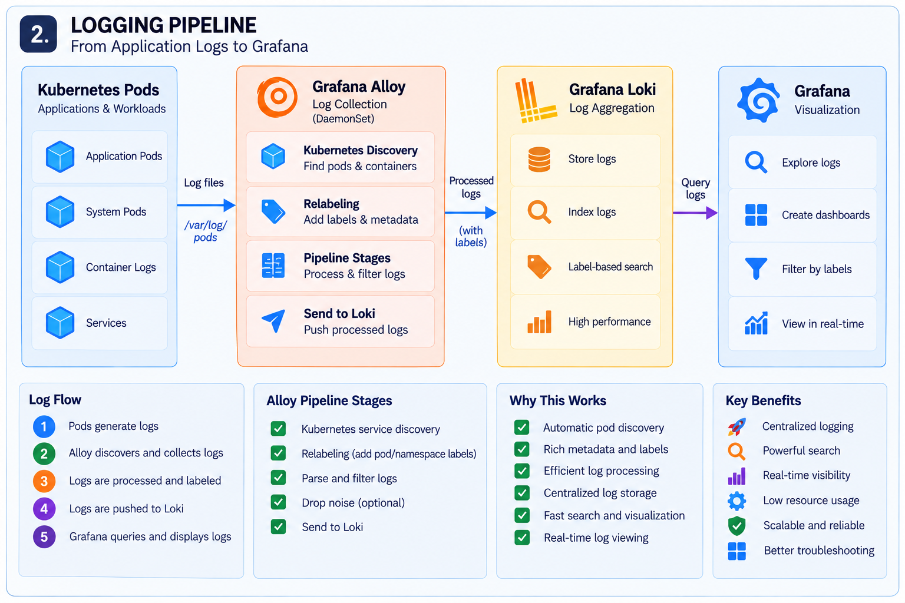
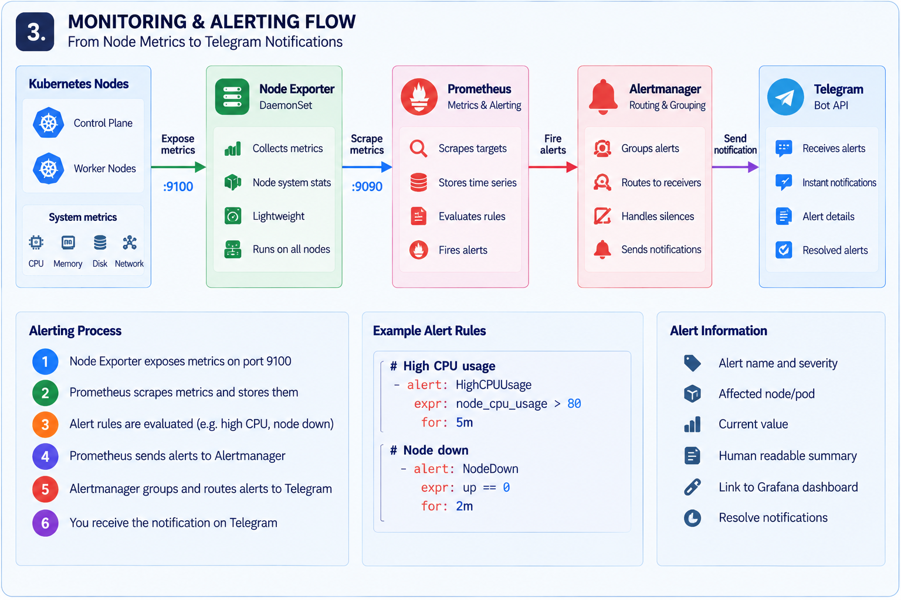
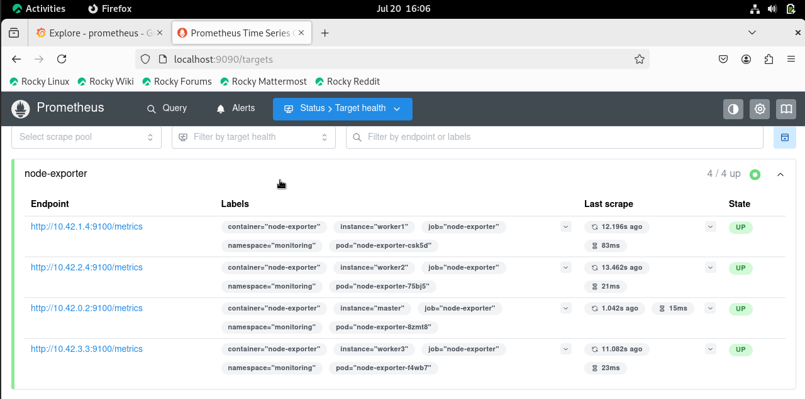
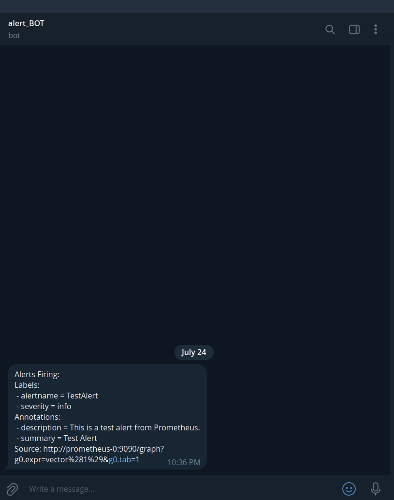
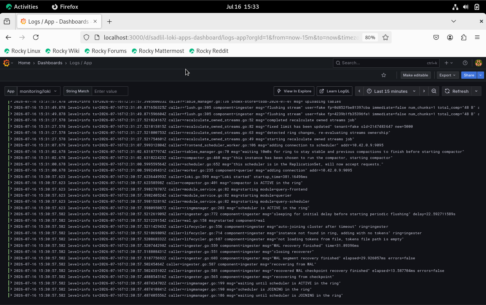
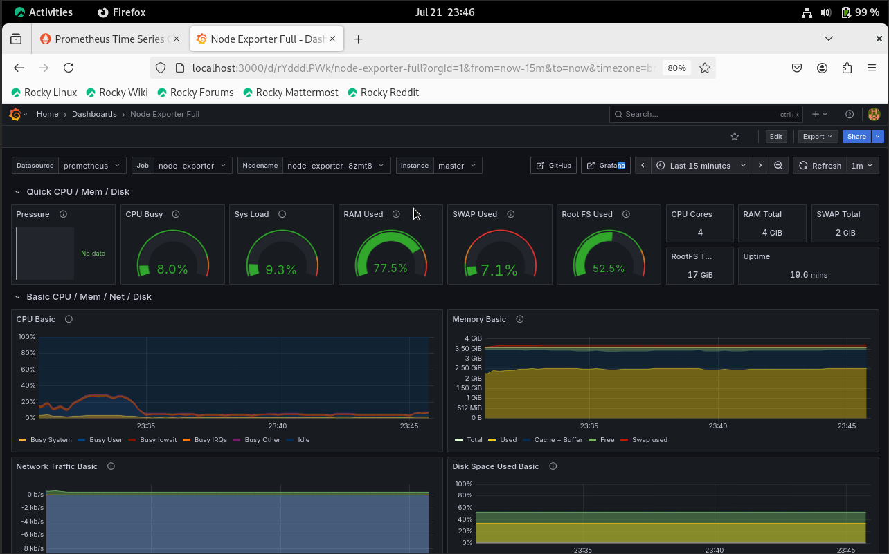
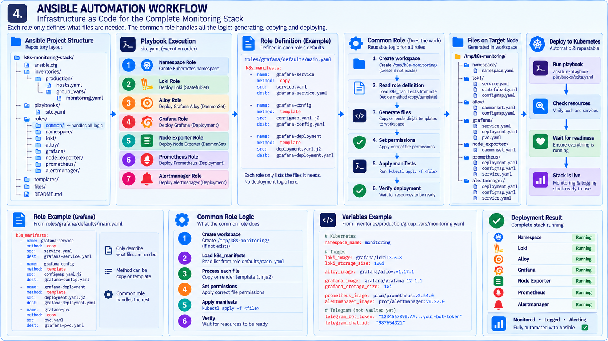
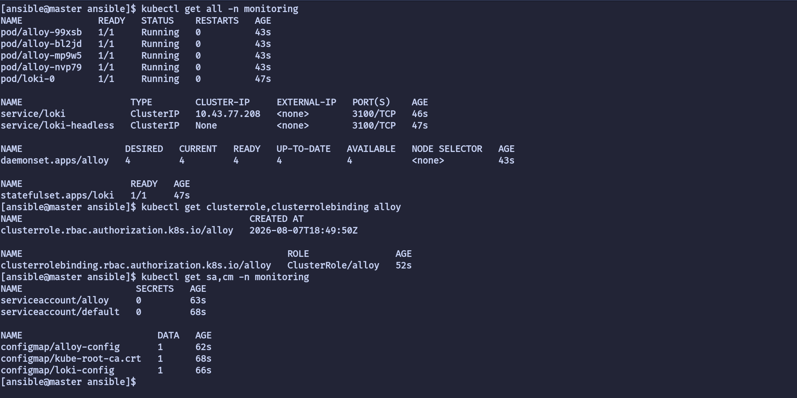

# Kubernetes Monitoring & Logging Stack

A Kubernetes monitoring and centralized logging project built on K3s, with the deployment automated using Ansible.

The goal of this project was to build a working monitoring and logging stack while also learning how to structure reusable Ansible automation instead of manually deploying every Kubernetes manifest.

---

## Overview

The final stack consists of:

- K3s — Kubernetes cluster
- Grafana Alloy — Kubernetes pod log collection and processing
- Loki — centralized log aggregation
- Prometheus — metrics collection and alert evaluation
- Node Exporter — node-level metrics
- Grafana — dashboards and visualization
- Alertmanager — alert routing
- Telegram — alert notifications
- Ansible — deployment automation

The cluster consists of one K3s control-plane node and three worker nodes.

---

## Architecture

### Overall Architecture



The architecture above shows how the Kubernetes cluster connects to the monitoring, logging and alerting components.

---

## Logging Pipeline

Application logs are collected from Kubernetes pods by Grafana Alloy.

Alloy discovers pods running on each node, applies relabeling and processing rules, and forwards the logs to Loki.




### Grafana Alloy

Alloy is responsible for:

- Discovering Kubernetes pods
- Restricting discovery to the current node
- Extracting Kubernetes metadata
- Relabeling
- Reading Kubernetes pod logs
- Processing logs
- Forwarding logs to Loki

#### Loki

Loki provides centralized log aggregation for the Kubernetes cluster.

> The current deployment uses a single Loki instance with persistent storage.

---

## Monitoring & Alerting

Prometheus collects metrics from the Kubernetes nodes through Node Exporter.




#### Node Exporter

Node Exporter runs as a DaemonSet so that each Kubernetes node has a metrics exporter.

It provides system-level metrics such as CPU, memory, disk and network statistics

#### Prometheus

Prometheus collects metrics from the configured targets and evaluates alert rules.



#### Alertmanager

Alertmanager receives firing alerts from Prometheus and routes them to the configured notification destination.

The current configuration sends notifications to Telegram.

#### Telegram

The alerting pipeline was tested by triggering a test alert and successfully receiving the notification through Telegram.



---

#### Grafana

Grafana provides the main interface for viewing metrics and logs.

It is used to:

- Query Loki logs
- Visualize Prometheus metrics
- Display monitoring dashboards





---

## Ansible Automation

The Kubernetes manifests are deployed through an Ansible automation framework.

Each application has its own role. The application role only describes the manifests that need to be deployed and which method should be used for each file.

The reusable deployment logic is handled by the `common` role.



#### Role structure

The playbook executes the application roles in order:

```
namespace
    
loki
    
alloy
    
grafana
    
node_exporter
    
prometheus
    
alertmanager
```

The `common` role is not called directly from the playbook.

Instead, each application role calls the `common` task logic and provides its k8s_manifests definition.

For example:

```yaml
# roles/grafana/defaults/main.yaml

k8s_manifests:
  - name: grafana-service
    method: copy
    src: grafana-service.yaml
    dest: grafana-service.yaml

  - name: grafana-deployment
    method: template
    src: grafana-deployment.yaml.j2
    dest: grafana-deployment.yaml

  - name: grafana-pvc
    method: template
    src: grafana-pvc.yaml.j2
    dest: grafana-pvc.yaml
```

The common role then handles the actual process:

1. Create the temporary workspace at /tmp/k3s-monitoring.
2. Read the k8s_manifests definition.
3. Process each manifest.
4. Copy static files or render Jinja2 templates.
5. Apply the generated manifests using kubectl.

This keeps the deployment logic in one place instead of repeating the same tasks in every application role.

---

## Variables

Environment-specific configuration is stored in the inventory group_vars.

Example:

```yaml
namespace_name: monitoring

loki_image: grafana/loki:3.6.8
loki_storage_size: 10Gi

alloy_image: grafana/alloy:v1.17.1

grafana_image: grafana/grafana:12.1.1
grafana_storage_size: 1Gi

prometheus_image: prom/prometheus:v2.54.0

alertmanager_image: prom/alertmanager:v0.27.0

telegram_bot_token: "..."
telegram_chat_id: "..."
```

The Telegram credentials are currently stored as Ansible variables but are **not vaulted yet**.

Using Ansible Vault is planned as a future improvement.

---

## Usage

#### Requirements

Before running the playbook, make sure the control-plane node has:

- Ansible installed
- `kubectl` installed
- A valid K3s kubeconfig
- Required Kubernetes permissions (Firewalld Restrictions if on RedHat family)
---

#### Running the playbook

Clone the repository on the K3s control-plane node and enter the Ansible project:

```Bash
cd kubernetes-monitoring-stack/ansible
```

Run:

```Bash
ansible-playbook playbooks/site.yaml
```

The playbook executes against `localhost`.

In this project, `localhost` refers to the **K3s control-plane node where the playbook is being executed.**

---

## Verify the deployment

After the playbook finishes:

```Bash
kubectl get all -n monitoring
```

Check the pods:

```Bash
kubectl get pods -n monitoring -o wide
```

Check persistent storage:

```Bash
Check persistent storage:
```

---

## Testing

The automation was tested by running the playbook against a clean environment.

The playbook was then executed a second time to verify idempotency.

#### First run

```Bash
ansible-playbook playbooks/site.yaml
```

The first run creates the required Kubernetes resources.

#### Second run

```Bash
ansible-playbook playbooks/site.yaml
```

The second run does not recreate resources that are already created.

---

## Kubernetes Verification

After deployment:

```Bash
kubectl get all -n monitoring
```

The expected monitoring and logging components should be running in the `monitoring` namespace.



---

## Repository Structure

```text
kubernetes-monitoring-stack/
│
├── ansible/
│   ├── ansible.cfg
│   │
│   ├── inventories/
│   │   └── production/
│   │       ├── hosts.yaml
│   │       └── group_vars/
│   │           └── monitoring.yaml
│   │
│   ├── playbooks/
│   │   └── site.yaml
│   │
│   └── roles/
│       ├── common/
│       ├── namespace/
│       ├── loki/
│       ├── alloy/
│       ├── grafana/
│       ├── node_exporter/
│       ├── prometheus/
│       └── alertmanager/
│
├── docs/
│   ├── diagrams/
│   └── screenshots/
│
├── kubernetes/
│   ├── alertmanager/
│   ├── alloy/
│   ├── demo-app/
│   ├── grafana/
│   ├── loki/
│   ├── namespaces/
│   ├── node-exporter/
│   ├── prometheus/
│   └── storage/
│
└── README.md
```

---

## Limitations

The current version is designed as a learning and portfolio project rather than a highly available production monitoring platform.

Current limitations include:

- Loki is deployed as a single instance.
- Alertmanager is deployed as a single instance.
- Telegram credentials are not yet managed with Ansible Vault.
- The current storage configuration is intended for the lab environment.
- Some container images may be affected by registry or network restrictions in the deployment environment.

---

## Future Improvements

- Ansible Vault for sensitive variables
- Highly available Loki
- Highly available Prometheus
- Highly available Alertmanager
- Additional Prometheus alert rules
- Additional Grafana dashboards
- Backup and restore procedures
- Stronger Kubernetes security configuration
- Grafana Alloy improvements and additional telemetry collection

---

## What I Learned

- How Kubernetes monitoring and logging components work together.
- How Grafana Alloy collects and processes Kubernetes logs.
- How Loki stores and exposes logs.
- How Prometheus collects metrics and evaluates alert rules.
- How Alertmanager routes alerts.
- How Kubernetes DaemonSets, StatefulSets, Deployments, Services, ConfigMaps and RBAC resources fit together.
- How to structure reusable Ansible roles.
- How to separate application-specific definitions from common deployment logic.
- When to use Ansible copy and template.
- How to use variables instead of hard-coding configuration.
- How to test Ansible idempotency.
- How to debug automation failures and understand why they occur.

